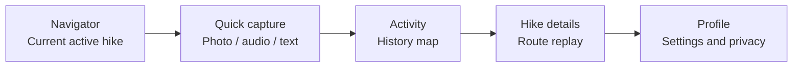
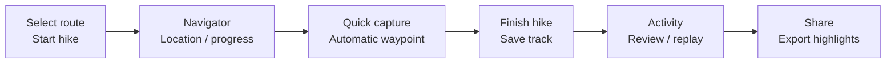

# 0001 — Short-Hike Navigation and Memory Capture

- Status: Draft
- Owner: @nan
- Updated: 2026-07-18
- Source version: v2.0 — Short-Hike Focus

> Follow the route and pin every moment to the map.

## Problem

Short-hike users often have to switch between navigation, photography, voice recording, and note-taking. Traditional navigation tools focus on getting somewhere, while photo and note apps focus on what was captured. They do not provide a low-friction way to bind route progress and live location to material captured in the moment, then revisit it later through a map and timeline.

EchoPrint v2.0 is designed for short hikes. While a user follows a preset or imported route, the app shows their current location, route progress, and off-route alerts. At any point, the user can quickly take a photo, record audio, or write a note. Each record is associated with GPS coordinates, a timestamp, and track progress, forming a hiking memory that can later be retraced on the map.

## Goals / Non-goals

- **Goals**
  - Help users complete short hikes with lightweight route guidance, progress, and off-route alerts.
  - Keep photo, audio, and text capture inside the navigation context and automatically bind each record to its time and place.
  - Let users open photos, original audio, and notes from map waypoints or return to their locations from the timeline.
  - Build a lasting personal hiking history on the Activity overview map.
- **Non-goals**
  - Travel booking, city tourism, or a social following feed.
  - Professional offline rescue, safety guarantees, or complex route planning.
  - Automatic publishing to WeChat, Instagram, or other third-party platforms.
  - Real-time location sharing between multiple users.

## User stories

- As a hiker, I want to see my current location, completed progress, and off-route alerts so that I can finish the hike with greater confidence.
- As a hiker, I want to take photos, record audio, or write notes without leaving navigation so that capturing a moment does not interrupt the hike.
- As a hiker, I want each record to be automatically bound to its location, time, and track progress so that I can accurately return to that moment later.
- As a returning user, I want to open a hike from the Activity map and replay it through a synchronized map and timeline so that I can revisit the complete experience.
- As a privacy-conscious user, I want to hide precise locations, times, and original audio before sharing so that I control what becomes public.

## Proposed solution

### MVP scope

| In scope | Not in the first release |
| --- | --- |
| Select, start, finish, and revisit a short-hike route | Travel booking, city tourism, or social feeds |
| Live location, route rendering, route progress, and off-route alerts | Professional offline rescue/safety guarantees or complex route planning |
| Map waypoints containing photos, audio, or text | Automatic publishing to WeChat or Instagram |
| Historical overview map, route replay, and basic sharing | Real-time group location sharing |

### Users and scenarios

| Scenario | Duration | Primary tasks | Design priorities |
| --- | --- | --- | --- |
| Urban-edge trail | 1–3 hours | Follow a route, photograph scenery, leave a short note | One-tap start, clear map, fixed capture controls |
| Half-day hike | 3–8 hours | Track progress, record breaks and highlights | Continuous track, offline-first capture, off-route alerts |
| Nature exploration | 4–10 hours | Capture continuously and review the full journey | Route replay, connected waypoints, end-of-hike summary |

### Information architecture

| Primary page | Role | Main content | Primary actions |
| --- | --- | --- | --- |
| Navigator | Action page for the current Active Hike | Map, route, current location, waypoints, timeline | Photo, audio, text, finish |
| Activity | Spatial index of previous hikes | Overview map, points, route previews, annual statistics | Select a hike |
| Profile | Personal and application controls | Avatar, theme, units, permissions, privacy | Change settings |

### Domain model and rules

| Object | Definition | Key fields |
| --- | --- | --- |
| Hike | A container for one active or completed short hike | Route, track, start/end times, distance, privacy, status |
| Route | A planned path the user follows; may be absent | Route points, source, estimated distance, route tolerance |
| Waypoint Moment | One multimodal record attached to the track | Coordinates, time, track progress, image, audio, text, tags |
| Track Point | A time-ordered location sample | Coordinates, accuracy, time, optional speed |

- When creating a Moment, bind it to the nearest valid location. If permission is unavailable or accuracy is poor, still allow capture and clearly show “Location unknown” or “Unstable location.”
- Trigger an off-route alert only after consecutive location samples fall outside the route tolerance, avoiding alerts from isolated GPS drift. The user can mute alerts.
- Stop background track sampling after the hike ends. Records may still be edited, but the original track must remain immutable.
- By default, sharing hides precise start and end points, the complete time-based track, and original audio.

### Page and flow requirements

#### S01 — Route selection and hike start

- **Goal:** Create an Active Hike.
- **Entry:** Route card in Activity, route import, or a recommended-route entry point.
- **Content:** Route preview, distance/difficulty, Start button, and location explanation.
- **Rules:** Allow a free-capture mode without a route; do not perform off-route checks in that mode.
- **Happy path:** Select route → confirm location permission → tap Start and create Hike → enter Navigator and begin sampling.

#### S02 — Navigator (current hike)

- **Goal:** Provide the primary navigation and capture experience.
- **Entry:** Automatically after starting a hike, or through the bottom Navigator tab.
- **Content:** Live map, route, current location, time/distance, off-route alert, map waypoints, pull-up timeline, and three fixed controls for photo/audio/text.
- **Rules:** Show a temporary waypoint immediately after capture; continue recording on weak networks and show sync status.
- **Happy path:** Open page and load route/location → move along the route while progress updates → tap waypoints to view records → pull up the timeline to browse moments → finish and enter confirmation.

#### S03 — Quick photo

- **Goal:** Capture scenery and create an image waypoint.
- **Entry:** Photo control in Navigator.
- **Content:** Camera, shutter, preview, delete/confirm, and optional short caption.
- **Rules:** Save a location snapshot when the shutter fires; cancellation creates no record; confirmation returns directly to Navigator.
- **Happy path:** Tap Photo → capture and save a local image → confirm and bind time/location → show waypoint in Navigator.

#### S04 — Quick audio

- **Goal:** Quickly capture a reaction, thought, or ambient sound.
- **Entry:** Audio control in Navigator.
- **Content:** Hold-to-talk or tap-to-record, duration, waveform, stop, and cancel.
- **Rules:** Create a draft waypoint when recording starts; preserve the original audio after stopping and transcribe it in the background; prevent accidental hike completion while recording.
- **Happy path:** Tap Audio and request microphone permission → record with timer → stop and save audio → transcribe in the background and update the waypoint.

#### S05 — Quick text

- **Goal:** Write one or several sentences about the current moment.
- **Entry:** Text control in Navigator.
- **Content:** Short text input, mood, location visibility, and Save.
- **Rules:** Return directly to Navigator after saving rather than opening details; show a text summary on the waypoint.
- **Happy path:** Tap Text → write a note and optionally select a mood → save and bind time/location → show waypoint in Navigator.

#### S06 — Finish hike

- **Goal:** Stop sampling and save the route.
- **Entry:** Finish control in Navigator.
- **Content:** Distance, duration, waypoint count, suggested cover, and finish confirmation.
- **Rules:** Require a second confirmation; stop background location; show “Syncing” when uploads remain queued.
- **Happy path:** Tap Finish and show summary → confirm and stop sampling → save Hike and open details → view route replay.

#### S07 — Activity (hike history map)

- **Goal:** Explore previous hikes on a map.
- **Entry:** Bottom Activity tab.
- **Content:** Map, points/routes, year filter, statistics, and selected-hike card.
- **Rules:** Cluster nearby points; blur locations on the overview map by default and show the detailed route only after selection.
- **Happy path:** Open Activity and load history → zoom/filter to update points → select a point and show its hike card → enter details and replay.

#### S08 — Hike details and route replay

- **Goal:** Revisit all waypoints along a completed route.
- **Entry:** Activity point or the end-of-hike flow.
- **Content:** Route map, replay progress, waypoint list, timeline, AI summary, and sharing.
- **Rules:** Synchronize map and timeline in both directions: dragging progress selects the corresponding Moment, and tapping a Moment moves the map.
- **Happy path:** Enter details and display route → drag replay to update the current point → tap a waypoint and expand its material → read the journey through the timeline → preview and export a share.

#### S09 — Profile

- **Goal:** Manage theme, units, permissions, and privacy.
- **Entry:** Bottom Profile tab.
- **Content:** Avatar, theme, kilometres/miles, permission status, data, and privacy.
- **Rules:** Permission controls only deep-link to system settings; do not offer a default clear-all-history action on this page.
- **Happy path:** Open Profile and load settings → change theme/units with immediate effect → manage permissions in system settings → return and preserve preferences.

### Map, navigation, and waypoint behaviour

| Capability | P0 behaviour | Constraints and failure states |
| --- | --- | --- |
| Current location | Show current location, direction when supported, and accuracy state | Show “Unstable location” when accuracy is poor; do not force correction |
| Route | Distinguish the planned route from the completed track and show progress | Support free capture if route loading fails |
| Off-route alert | Show a non-blocking alert after sustained deviation beyond route tolerance | May be muted; must not imply rescue or a safety guarantee |
| Map waypoints | Use distinct icons for photos, audio, and text; tap to open details | Records without a location appear only on the timeline |
| Replay | Highlight the track and waypoints preceding the selected replay time | Preserve the track’s original chronological order |

- Photo waypoints may show a thumbnail or camera icon; audio waypoints show a microphone or waveform; text waypoints show a short excerpt.
- Cluster multiple records created at the same location within a short period, expanding them on tap to avoid obscuring the route.
- The map is the spatial index of records; the timeline is their narrative index. Both must reference the same Moment.

### Activity, annual recap, and sharing

| View | User task | Content |
| --- | --- | --- |
| Map overview | Find a previous route | Point clustering, route previews, year/month filters |
| Annual recap | Review one year of hiking | Count, total distance, total duration, representative routes, selected images |
| Hike details | Revisit one hike | Route replay, timeline, all waypoints, short AI summary |
| Share export | Generate publishable content | Cover, selected photos, short copy, blurred location, long image/link |

AI should have a deliberately limited role in the first short-hike release: transcribe audio, generate a title and short recap for a hike, and select highlight waypoints. It must not invent unrecorded places, companions, events, or emotions.

### Permissions, privacy, safety, and reliability

| Topic | Requirement |
| --- | --- |
| Location | Use background location only after the user actively starts a Hike; stop immediately after finishing or stopping. Users who deny permission can still use free capture. |
| Camera/microphone | Request access only after the user taps the corresponding capture control; if denied, provide a link to system settings. |
| Weak network | Save photos, audio, and text locally first; the sync queue must be retryable and have a clear state. |
| Privacy | Blur routes in Activity by default; require a preview before sharing and hide precise location, time, and original audio by default. |
| Safety | The product does not replace professional navigation, weather assessment, or emergency rescue; use neutral, non-alarming language for off-route alerts. |

## Success measures

| Metric | Definition | Purpose |
| --- | --- | --- |
| Hike start rate | Percentage of route-preview visits that create a Hike | Validate permission and start flows |
| Time to first waypoint | Median time from Hike start to the first valid record | Validate the three quick-capture controls |
| Waypoint location coverage | Moments with a valid location / all Moments | Monitor spatial association quality |
| History revisit rate | Percentage of hikes whose details are reopened within seven days | Validate memory value |
| Share export rate | Percentage of completed-detail visits that export content | Validate shareable outcome value |

### P0 acceptance criteria

- A user can start and finish a hike, after which it appears in Activity.
- Navigator contains the route, current location, waypoints, and three fixed quick-capture controls for photo/audio/text.
- When location is available, every captured item is accessible from both its map waypoint and the timeline.
- Capture remains usable and its state understandable when location is denied or inaccurate, the network is weak, an upload fails, or the user leaves the route.
- Activity opens hike details from the map; the detail map replay and timeline synchronize in both directions.
- Before sharing, users can remove photos, text, location, and time.
- Creating a waypoint takes no more than three primary actions after tapping a quick-capture control.
- Every record with a valid location appears at the corresponding position on the track where it was created.
- A user can open a hike from Activity and find the location of a photo within 30 seconds.
- Off-route messaging is described only as an alert and never promises route safety or rescue.

## Open questions

- **Route sources:** Should the first release support only a small set of preset routes or GPX import to avoid building complex route planning too early?
- **Map SDK:** Which option covers route rendering, track sampling, location, and off-route alerts within the required boundaries?
- **Offline capability:** Should the MVP cache only the active route and recent track, deferring complete offline maps?
- **AI output:** Should the first release keep only lightweight hike summaries and highlight selection, deferring long-form narratives?

## Next step

Build low-fidelity prototypes for Navigator, the three quick-capture flows, the Activity history map, and hike-detail replay. Then run a real 1–2 hour hike to test the complete “route → capture → map waypoint → replay” loop.
